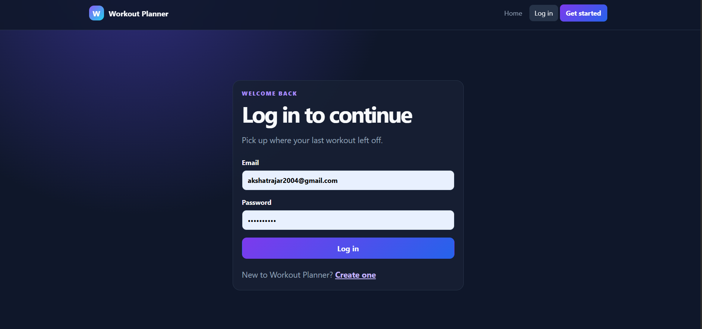
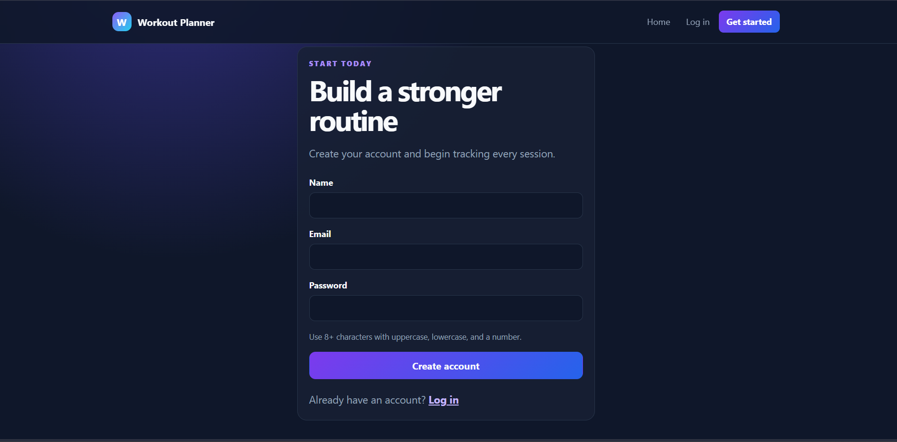
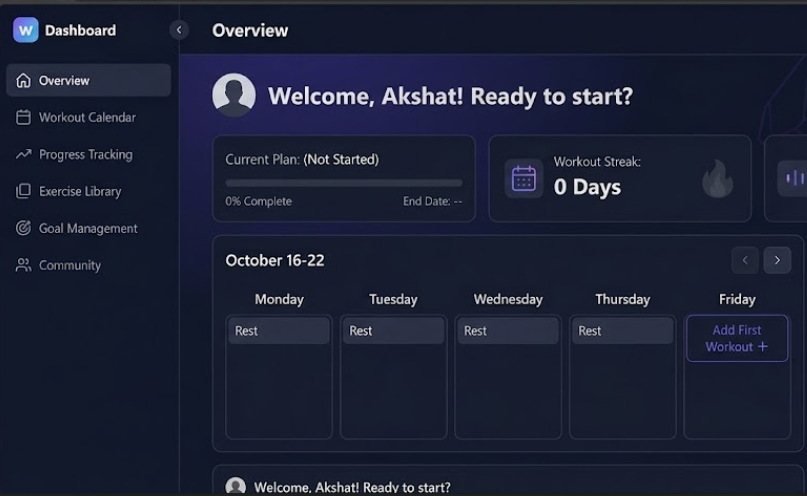
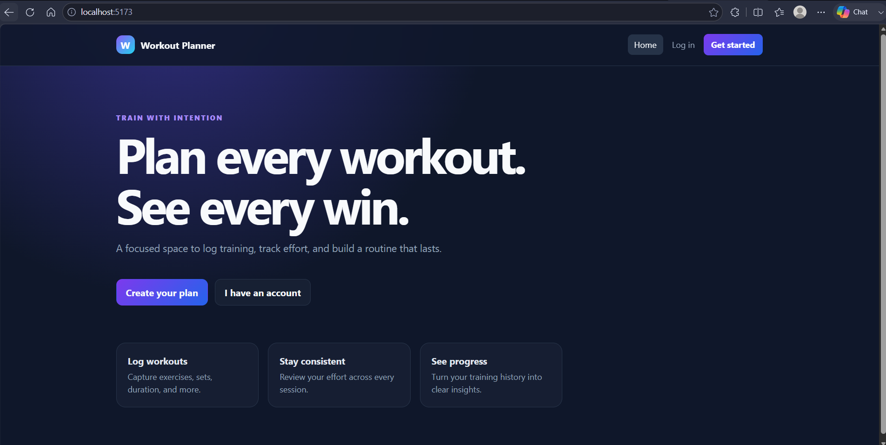

# 🏋️ Workout Planner

A **full-stack MERN Workout Planner** that helps users plan workouts, track training progress, and analyze weekly activity through an intuitive dashboard.

Built with **React 19**, **Node.js**, **Express**, **MongoDB**, and **JWT Authentication**, the application provides a modern, responsive, and secure workout management experience.

---

## 🚀 Features

### 🔐 Authentication
- User Signup & Login
- JWT Authentication
- Protected Routes
- Password Hashing with bcrypt
- Automatic Logout on Token Expiry

### 💪 Workout Management
- Create Workouts
- View Personal Workout History
- Update Existing Workouts
- Delete Workouts
- Search by Workout or Exercise
- Filter by Category
- Sort by Date

### 📊 Dashboard
- Weekly Workout Summary
- Total Training Volume
- Seven-Day Activity Chart
- Category Distribution
- Personal Statistics

### 🎨 User Interface
- Responsive Design
- Dark Theme
- Loading Indicators
- Empty States
- Error Handling
- Toast Notifications
- Delete Confirmation Dialog

### 🛡️ Security
- JWT Authentication
- Password Encryption
- Express Validator
- Helmet Security Headers
- Rate Limiting
- CORS Protection
- MongoDB Injection Sanitization
- Ownership Authorization Checks

---

# 🛠️ Tech Stack

| Frontend | Backend | Database | Security |
|-----------|----------|----------|----------|
| React 19 | Node.js | MongoDB | JWT |
| React Router | Express.js | Mongoose | bcrypt |
| Axios | Express Validator | MongoDB Atlas | Helmet |
| Context API | REST API | Local MongoDB | Rate Limiter |
| CSS Modules | | | |

---

# 📁 Project Structure

```text
Workout-Planner/
│
├── backend/
│   ├── config/
│   ├── controllers/
│   ├── middleware/
│   ├── models/
│   ├── routes/
│   ├── utils/
│   └── server.js
│
├── frontend/
│   ├── src/
│   │   ├── components/
│   │   ├── context/
│   │   ├── hooks/
│   │   ├── pages/
│   │   ├── services/
│   │   └── App.jsx
│
├── render.yaml
├── package.json
└── README.md
```

---

# ⚙️ Installation

## Prerequisites

- Node.js 20+
- MongoDB Community Server **or** MongoDB Atlas

---

## Clone Repository

```bash
git clone https://github.com/yourusername/workout-planner.git

cd workout-planner
```

---

## Install Dependencies

```bash
npm install
```

---

## Configure Environment Variables

### Backend (`backend/.env`)

```env
NODE_ENV=development
PORT=5000

MONGODB_URI=mongodb://127.0.0.1:27017/workout-planner

JWT_SECRET=your_super_secret_key

JWT_EXPIRES_IN=7d

CLIENT_URL=http://localhost:5173
```

### Frontend (`frontend/.env`)

```env
VITE_API_BASE_URL=http://localhost:5000/api
```

---

## Start Application

```bash
npm run dev
```

Frontend

```
http://localhost:5173
```

Backend

```
http://localhost:5000
```

---

# 📜 Available Scripts

```bash
npm run dev              # Run frontend + backend

npm run dev:frontend     # React app only

npm run dev:backend      # Express server only

npm run build            # Production frontend build
```

---

# 🌐 REST API

## Authentication

| Method | Endpoint |
|---------|----------|
| POST | `/api/user/signup` |
| POST | `/api/user/login` |

---

## Workouts

| Method | Endpoint |
|---------|----------|
| GET | `/api/workouts` |
| POST | `/api/workouts` |
| GET | `/api/workouts/:id` |
| PATCH | `/api/workouts/:id` |
| DELETE | `/api/workouts/:id` |

---

## Health Check

```
GET /api/health
```

---

# 📝 Sample Workout

```json
{
  "title": "Upper Body Strength",
  "category": "Strength",
  "exercise": "Bench Press",
  "sets": 4,
  "reps": 8,
  "weight": 70,
  "duration": 50,
  "calories": 380,
  "date": "2026-07-30",
  "notes": "Controlled tempo on final set"
}
```

---

# 🔑 Environment Variables

| Variable | Description |
|-----------|-------------|
| MONGODB_URI | MongoDB Connection String |
| JWT_SECRET | Secret Key |
| JWT_EXPIRES_IN | Token Expiry |
| CLIENT_URL | Frontend URL |
| PORT | Backend Port |
| VITE_API_BASE_URL | Backend API URL |

---

# 🚀 Deployment

## Backend (Render)

- Push repository to GitHub
- Create MongoDB Atlas Cluster
- Deploy using Render
- Add Environment Variables
- Verify `/api/health`

---

## Frontend (Vercel)

- Import Repository
- Root Directory → `frontend`
- Set `VITE_API_BASE_URL`
- Deploy
- Update Backend `CLIENT_URL`

# 📷 Screenshots

## Login



## Register



## Dashboard



## Main UI



# 🔮 Future Improvements

- Password Reset
- User Profile
- Avatar Upload
- Workout Goals
- CSV/PDF Export
- Pagination
- Notifications
- Unit & Integration Testing
- Progressive Web App (PWA)

---

# 🤝 Contributing

Contributions are welcome!

Feel free to fork the repository, create a feature branch, and submit a Pull Request.

---

# 📄 License

This project is licensed under the **MIT License**.

---

## ⭐ Support

If you found this project helpful, consider giving it a ⭐ on GitHub.

Happy Coding! 🚀
